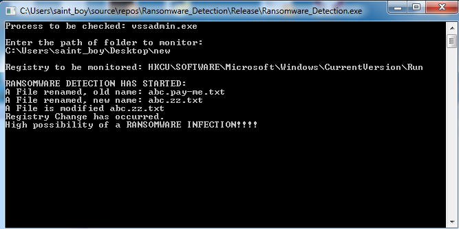
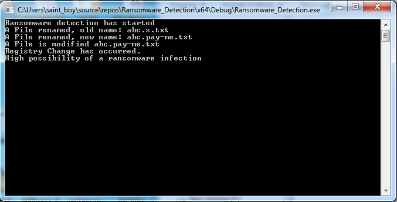

# Ransomware-Detection
Visual C++ console application to detect ransomware activity on Windows OS. It consists of a registry monitor, filesystem watcher and a process detector.

# Requirements
* Visual Studio 2017(To open the source project)
* Visual C++ 2017 runtime library 

# Description
Ransomware is a malware/malicious software program designed to block or disable access to the data your computer until a sum of money is paid.
The project aims at detecting and notifying the user of potential ransomware behavior on the windows system.
I decided on three parameters on which the behavior can be judged after studying the behavior of various ransomware.

* Detecting a Process commonly executed by Ransomware.(In my project I am detecting VSSadmin process which is commonly run by Ransomware for deleting backup files)
* Monitoring a commonly affected Windows Registry key for changes.
* Creating a honeypot folder, and monitoring it for any file changes.(renames and deletes)

The project is multithreaded so that all the three features can be run asynchronously.
If the program signals for any 2 out of the 3 parameters, it notifies it as a high risk of Ransomware Detection.  

A time window of 5 minutes is considered for the Ransomware to take action.
It is considered as a high possibility of a Ransomware activity if and only if the time difference between any two actions is less than 5 minutes.

## Screenshots:

